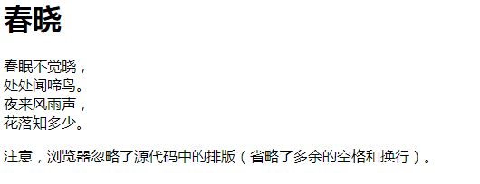

 # 笔记

 >作者：王
 
```Python
提示：Ctrl+F搜索   

注意：搜索标签时前面后加空格 “ < p > 正确 ” “ <p> 错误 ”
```
## 标签查找
 - [< dr >](#<p>-换行)
 - [< p >](#<p>-创建一段文本)
 - [< a >](#<a>-超链接)
 - [< target >](#<target>-打开方式)
 - [< h1 >](#<h1>-标题)
## HTML 标签

## < br > 换行
 
## < p > 创建一段文本

< p >标签的用法
 ```Python
<h1>春晓</h1>

<p>
   春眠不觉晓， <br/>
   处处闻啼鸟。<br/>
   夜来风雨声，<br/>
   花落知多少。<br/>
</p>

<p>注意，浏览器忽略了源代码中的排版（省略了多余的空格和换行）。</p>
```
>效果



```Python
王：管他什么。<p>标签就是创建一段文本。
```
## < a > 超链接

< a href="域名">< /a >
 ```Python
 <a href="http://https://wsb-android.github.io/Hello/n"></a>
```
 - href是指定链接的目标
 
## target 打开方式

 - blank ：创建新窗口页
 
 ```Python
 <a href="https://wsb-android.github.io/Hello/n" target="_blank" title="转到WSB-Android主页">DIVCSS5</a>
```

 - parent：父级打开网页
 
```Python
 <a href="https://wsb-android.github.io/Hello/n" target="_parent" title="转到WSB-Android主页">DIVCSS5</a>
```

## < h1 > 标题

```Python
<h1>这是标题 1</h1>
<h2>这是标题 2</h2>
<h3>这是标题 3</h3>
```

## < b > 加粗

## < strong > 加粗

## < em > 斜体

## < i > 斜体

## < u > 下划线

## < s > 删除线

## < img > 图片标签

 - src - 图片路径
 ```Python
 
```
 

## < sup > 上标
菜的抠脚<sup>666666</sup>

## < sub > 下标
菜的抠脚<sub>666666</sub>

## < hr > 水平线
<hr>抠脚？6666<hr>


## CSS 样式
 
## 外部样式导入
CSS样式导入
```Python
 <link rel="stylesheet" type="text/css" href="mystyle.css>
```
JS样式导入
```Python
 <link rel="stylesheet" type='text/javascript' href="js/new_file.js" />
```
内联样式
```Python
 <p style="color:sienna;margin-left:20px">这是一个段落。</p>
```

## width 宽度
 - width：100%；百分比计算宽度
 - width：100px；像素计算宽度
 - width：100em；长度单位

## height 高度
 - height：100%；百分比计算高度
 - height：100px；像素计算高度
 - height：100em；对长度单位

## background-color 背景颜色

 - background-color：#000；

## background-image 背景图片

 - background-image：url（图片地址）；

## background-repeat 背景平铺方向

 - background-repeat:
 - repeat-x；水平平铺 
 - repeat-y；垂直居中
 - no-repeat；不平铺

## background-position 背景图像位置

 - top、bottom、left、right，center；可以使用长度值，如 100px 或 5em
 - background-position：
 - 50% 50%；百分百
 - 50px 50px；像素
 - top；上面
 - bottom；下面
 - left；左边 
 - right；右边
 - center; 居中
 - left top；左上
 - left bottom；左下
 - left center；向左居中
</br> ...

简单书写：body {background:#颜色 url('图片') 平铺 图像位置;} 
```Python
 body {background:#ffffff url('img_tree.png') no-repeat right top;}
```
body {background:#白色 url('图片') 不平铺 向右上;}

## font-family 字体

## margin：0 auto; 水平居中
