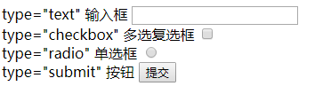
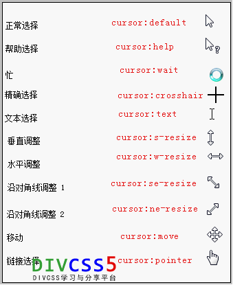

 # 笔记

 >作者：王
 
## HTML 标签

### 标签查找
 - [< br > 换行](#br-换行)
 - [< p > 创建文本](#p-创建一段文本)
 - [< a > 超链接](#a-超链接)
 - [< h1 > 标题](#h1-标题)
 - [< b > 加粗](#b-加粗)
 - [< strong > 加粗](#strong-加粗)
 - [< em > 斜体](#em-斜体)
 - [< i > 斜体](#i-斜体)
 - [< u > 下划线](#u-下划线)
 - [< s > 删除线](#s-删除线)
 - [< img > 图片标签](#img-图片标签)
 - [< sup > 上标](#sup-上标)
 - [< sub > 下标](#sub-下标)
 - [< hr > 水平线](#hr-水平线)

## CSS 样式

## JavaScript 
 
## br 换行

## p 创建一段文本

< p >标签的用法
 ```Python
<h1>春晓</h1>

<p>
   春眠不觉晓， <br/>
   处处闻啼鸟。<br/>
   夜来风雨声，<br/>
   花落知多少。<br/>
</p>

<p>注意，浏览器忽略了源代码中的排版（省略了多余的空格和换行）。</p>
```
>效果


```Python
王：管他什么。<p>标签就是创建一段文本。
```
## a 超链接

< a href="域名">< /a >
 ```Python
 <a href="http://https://wsb-android.github.io/Hello/n"></a>
```
 - href是指定链接的目标
 
 触发：
 - a:active 是超级链接的初始状态
 - a:hover 是把鼠标放上去时的状况
 - a:link 是鼠标点击时
 - a:visited 是访问过后的情况
 
## target 打开方式

 - blank ：创建新窗口页
 
 ```Python
 <a href="https://wsb-android.github.io/Hello/n" target="_blank" title="转到WSB-Android主页">DIVCSS5</a>
```

 - parent：父级打开网页
 
```Python
 <a href="https://wsb-android.github.io/Hello/n" target="_parent" title="转到WSB-Android主页">DIVCSS5</a>
```

## h1 标题

```Python
<h1>这是标题 1</h1>
<h2>这是标题 2</h2>
<h3>这是标题 3</h3>
```

## b 加粗

```Python
加粗<b>加粗</b>
```
加粗<b>加粗</b>

## strong 加粗

```Python
加粗<strong>加粗</strong>
```
加粗<strong>加粗</strong>

## em 斜体

```Python
加粗<em>加粗</em>
```
加粗<em>加粗</em>

## i 斜体

```Python
加粗<i>加粗</i>
```
加粗<i>加粗</i>

## u 下划线

```Python
加粗<u>加粗</u>
```
加粗<u>加粗</u>

## s 删除线

```Python
加粗<s>加粗</s>
```
加粗<s>加粗</s>

## img 图片标签

 - src - 图片路径
 ```Python
 
```
 

## sup 上标

```Python
 菜的抠脚<sup>666666</sup>
```
菜的抠脚<sup>666666</sup>

## sub 下标

```Python
 菜的抠脚<sub>666666</sub>
```
菜的抠脚<sub>666666</sub>

## hr 水平线

```Python
 <hr>抠脚？6666<hr>
```
<hr>抠脚？6666<hr>

## form 表单

## input 按钮

```Python
<form action="" method="get"> 
<label>type="text" 输入框</label> 
<input name="" type="text" size="22" /><br /> 
<label>type="checkbox" 多选复选框</label> 
<input name="" type="checkbox" value="" /><br /> 
<label>type="radio" 单选框</label> 
<input name="" type="radio" value="" /><br /> 
<label>type="submit" 按钮</label> 
<input name="" type="submit" value="提交" /> 
</form> 
```



## iframe 框架

```Python
 <iframe src="http://www.baidu.com/" width="400" height="200" scrolling="yes" />
```

<iframe 导入="域名" 宽度="400" 高度="200" 滚动="是" />

```Python
1、常常用于一个网页中局域显示另外网页

2、是否显示滚动条，可以在标签内设置scrolling的不同值属性定义。
```

## table tr td th 表格

```Python

//<table 宽度="300" 边界="1" 间距="0">

<table width="300" border="1" cellspacing="0"> 
    <tr> 
        <th>班级</th> 
        <th>日期</th> 
        <th>标题</th> 
    </tr> 
    <tr> 
        <td>一班</td> 
        <td>2012-5-10</td> 
        <td>标题1</td> 
    </tr> 
    <tr> 
        <td>二班</td> 
        <td>2012-5-20</td> 
        <td>标题2</td> 
    </tr> 
</table> 
```
<table width="300px" border="1" cellspacing="0"> 
    <tr> 
        <th>班级</th> 
        <th>日期</th> 
        <th>标题</th> 
    </tr> 
    <tr> 
        <td>一班</td> 
        <td>2012-5-10</td> 
        <td>标题1</td> 
    </tr> 
    <tr> 
        <td>二班</td> 
        <td>2012-5-20</td> 
        <td>标题2</td> 
    </tr> 
</table> 

#### 注释：表格结构中td和th使用，没有区别均可使用。 “ th、td是行 ” “ tr是列 ” 


## CSS 样式

## 外部样式导入
CSS样式导入
```Python
 <link rel="stylesheet" type="text/css" href="mystyle.css>
```

内联样式
```Python
 <p style="color:sienna;margin-left:20px">这是一个段落。</p>
```

## width 宽度
 - width：100%；百分比计算宽度
 - width：100px；像素计算宽度
 - width：100em；长度单位

## height 高度
 - height：100%；百分比计算高度
 - height：100px；像素计算高度
 - height：100em；对长度单位

## background-color 背景颜色

 - background-color：#000；

## background-image 背景图片

 - background-image：url（图片地址）；

## background-repeat 背景平铺方向

 - background-repeat:
 - repeat-x；水平平铺 
 - repeat-y；垂直居中
 - no-repeat；不平铺

## background-position 背景图像位置

 - top、bottom、left、right，center；可以使用长度值，如 100px 或 5em
 - background-position：
 - 50% 50%；百分百
 - 50px 50px；像素
 - top；上面
 - bottom；下面
 - left；左边 
 - right；右边
 - center; 居中
 - left top；左上
 - left bottom；左下
 - left center；向左居中
</br> ...

简单书写：body {background:#颜色 url('图片') 平铺 图像位置;} 
```Python
 body {background:#ffffff url('img_tree.png') no-repeat right top;}
```
body {background:#白色 url('图片') 不平铺 向右上;}

## border 边框

 - 四个边框
border-left 设置左边框
border-right 设置右边框
border-top 设置上边框
border-bottom 设置下边框

 - 四边相同边框border简写
#divcss5{border:1px solid #00F}
设置了divcss5对象盒子1px像素蓝色实线边框

 - 边框三个样式
通常我们可以对边框设置宽度（厚度）、边框样式、边框颜色这三个属性与参数。

 - 边框颜色：border-color:#000

 - 边框厚度（宽度）：border-width:1px
使用数字+单位设置边框厚度宽度，如1px(边框厚度宽度为1像素)，边框必须为正数字，大于0的数值。否则设置边框border样式无效。

 - border边框样式：border-style:solid

 - 边框样式值如下：
 - none : 　无边框。与任何指定的border-width值无关
 - hidden : 　隐藏边框。IE不支持
 - dotted : 　在MAC平台上IE4+与WINDOWS和UNIX平台上IE5.5+为点线。否则为实线（常用）
 - dashed : 　在MAC平台上IE4+与WINDOWS和UNIX平台上IE5.5+为虚线。否则为实线（常用）
 - solid : 　实线边框（常用）
 - double : 　双线边框。两条单线与其间隔的和等于指定的border-width值
 - groove : 　根据border-color的值画3D凹槽
 - ridge : 　根据border-color的值画菱形边框
 - inset : 　根据border-color的值画3D凹边
 - outset : 　根据border-color的值画3D凸边

## float 浮动
 - float:none 不使用浮动
 - float:left 靠左浮动
 - float:right 靠右浮动

## clear 清除浮动
 - clear:left 左不浮动
 - clear:right 右不浮动
 - clear:both 都不浮动
 - clear:none 不浮动
 - clear:inherit 继承

注释：继承：是指定继承父元素的相应属

## margin 外边距
 - margin-left 对象左边外延边距 （margin-left:5px; 左边外延距离5px）
 - margin-right 对象右边外延边距 （margin-right:5px; 右边外延距离5px）
 - margin-top 对象上边外延边距 （margin-top:5px; 上边外延距离5px）
 - margin-bottom 对象下边外延边距 （margin-bottom:5px; 下边外延距离5px）
 
 缩写：margin:5px 0 6px 4px  " margin:上 左 下 右 "
 
## margin：0 auto; 水平居中

## padding 内边距
 - padding-left 左边距
 - padding-right 右边距
 - padding-top 上边距
 - padding-bottom 下边距
 
## color 颜色

## font-size 字体大小
 - font-size:12px; 设置对象具体字体大小为12px
 - font-size:xx-small; 设置文字大小为最小
 - font-size:small; 设置文字字体大小为小
 - font-size:x-large; 设置对象字体大小为较大
 - font-size:larger; 设置对象字体大小为大
 - font-size:smaller; 相对于父容器中字体尺寸进行相对减小
 - font-size:50%; 相对于父容器中字体尺寸进行相应调整为50%大小
 - font-size:150%; 相对于父容器中字体尺寸进行相应调整为150%大小

## font-family 字体
 - HTML里字体设置 <font face="黑体">我是黑体字</font>
 - CSS里字体设置  .div{ font-family:"黑体";}
## display 显示隐藏

## position 定位
 - position：static 静态定位
 - position:relative 相对定位
 - position:absolute 绝对定位 
 - position:fixed 固定定位 相对浏览器定位
 
  | 定位模式         | 是否脱标占有位置          | 是否可以使用边偏移  | 移动位置的基准          |
  | --------------- | ------------------------ | ----------------- | ------------------------ |
  | 静态定位static	  | 不脱标，正常模式，占有位置 |  不可以            | 	正常模式                |
  | 相对定位relative	| 不脱标，占有位置	         |   可以            	|  相对自身的位置           |
  | 绝对定位absolute	| 脱标，不占有位置         	|   可以           	 |  相对于定义父级元素移动位置 |
  | 固定定位fixed	   | 脱标，不占有位置         	|   可以	            |  相对于浏览器移动位置       |

其他的都比较简单先看绝对定位吧：
 <br/>1.不要把他看得太难，其实很简单OJBK?
 <br/>2.随机定义一个相对定位，然后在定义一个你要移动的绝对定位，这样就OK了
 <br/>3.如果你定义多个定位的话你就要考虑堆叠顺序，z-index属性的是指定了一个元素的堆叠顺序（哪个元素应该放在前面，或后面）
一个元素可以有正数或负数的堆叠顺序：

## text-align 文本对齐
 - left : 左对齐
 - right : 右对齐
 - center : 居中

## cursor鼠标手势与光标
 - div{ cursor:default }默认正常鼠标指针
 - div{ cursor:hand }div{ cursor:text } 文本选择效果
 - div{ cursor:move } 移动选择效果
 - div{ cursor:pointer } 手指形状 链接选择效果
 - div{ cursor:url(url图片地址) }设置对象为图片



## JavaScript 

JS样式导入
```Python
 <link rel="stylesheet" type='text/javascript' href="js/new_file.js" />
```
